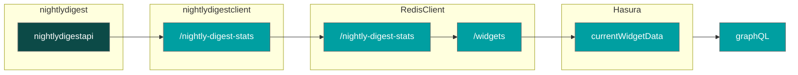

# Cloud Function for the nightlydigest API
This cloud function does some logic to get the last exposure from the nightly digest api

See [here](https://phalanx.lsst.io/environments/usdfdev/index.html#std-px-env-usdfdev) for more info on the nightlydigest documentation (but there may be a better link)

## Architecture
Planned architecture


## API description
We make calls to the nightly digest api which we do not own.

We support the following endpoints. All routes are require `Bearer` auth headers.
- `/` - health check that should respond with 200 for a health authed request
- `/nightly-digest-stats` - This has 2 modes depending on if `overrideRudDate` is passed as a query parameter:
    - If so, we reaccumulate exposures from the `surveyStartDate`, chunked in 30 day requests out of respect to the API maintainers.
    - otherwise, we simply get yesterday's data (unless overwritten by manually specifying the `startDate` and `endDate` query parameters)

## Deployment

First, build the typescript:

```
yarn build
```

The above command will create a `/dist` folder with the built Javascript.

Ensure you've populated the `.env.yaml` for Google Cloud Functions v2 deployment.

Then, ensure your `gcloud` CLI is pointed at the correct GCP project and deploy the cloud function:

```
sh deploy.sh
```

## Development
### Environment variables
- `NIGHTLY_DIGEST_API_TOKEN` - token for the nightly digest api
- `NIGHTLY_DIGEST_API_ENDPOINT` - nightly digest api endpoint where the data is sourced
- `NIGHTLY_DIGEST_CACHE_ENDPOINT` - redis endpoint to cache nightly digest values
- `REDIS_CACHE_TOKEN` - bearer auth token required to cache values
- `AUTH_TOKEN` - bearer auth token for the nightly digest cloud function itself
- `SURVEY_START_DATE` - survey start date if we ever need to reaccumulate data from the nightly digest api

### Start Development Server
Run local development server
```
yarn run start-dev
```

### Testing
Run tests
```
yarn run test
```

To generate a code coverage report:
```
yarn run test -- --coverage
```
with HTML output sent to `coverage/lcov-report/index.html`

To run mutation tests
```
yarn run mutate
```
with HTML output sent to `reports/mutation/mutation.html`


